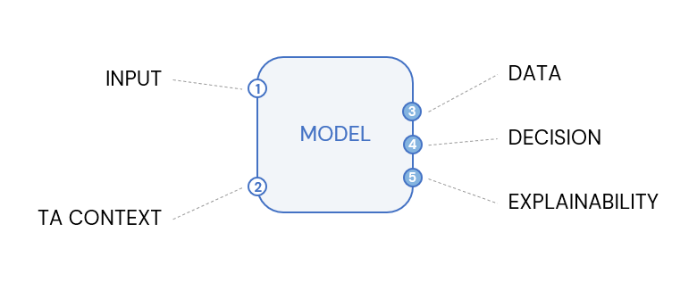

BlueCube is the methodology framework for Talent Acquisition decision intelligence, built on composable analytical primitives that produce explainable Health Scores on every requisition.

## Step 1: One BlueCube

A BlueCube is the analytical primitive of the methodology. One cube. One job. Inspectable from end to end.

Every Cube takes two inputs, runs a model, and produces three outputs. \
That's the whole shape.

### The Two Inputs

<Steps>
  <Step title="Input">
    The raw material the cube operates on. A dataset. A set of records. Whatever the cube is analyzing.
  </Step>
  <Step title="TA Context">
    What makes the BlueCube the BlueCube. Domain knowledge in structured form — peer group definitions, severity thresholds, role classifications, whatever the analytical work requires. TA Context is configuration. It can be a spreadsheet, a YAML file, or the output of another cube.
  </Step>
</Steps>

Without TA Context, the cube is a generic analytical method running against generic data. With TA Context, the cube becomes the TA-specific analytical work the methodology is authoring.

### The Model

The Model is what the cube does. Linear regression. KNN classification. KMeans clustering. DEA frontier analysis. Z-score peer benchmarking. Whatever method the cube's analytical work calls for.

The Model is open. A cube can use any method that produces defensible output against the inputs. The methodology doesn't prescribe a single method per cube — it specifies what comes in, what comes out, and that the work in between is documented.

### The Three Outputs

Every BlueCube produces the same three outputs, every time:

<Steps>
  <Step title="Data" stepNumber={3}>
    The dataframe. Per-row outputs from the model. Cluster labels, predictions, distances, classifications. The structured analytical result.
  </Step>
  <Step title="Decision" stepNumber={4}>
    The operational signal derived from the data. The Health Score contribution. The flag. The recommendation. The thing a TA operator can act on.
  </Step>
  <Step title="Explainability" stepNumber={5}>
    Plain English narrative explaining what the cube produced and why. Multi-run consensus counts. Confidence rates. The reason this requisition scored what it scored.
  </Step>
</Steps>

The three outputs are the cube's contract. Anything consuming a BlueCube knows it will receive a dataframe, a decision, and an explainability output. Always. Same shape across every cube.

### Why the Cube Matters

A black box produces an output and asks the consumer to trust it. The methodology underneath isn't visible. The reasoning isn't legible. The user has to decide whether to trust an opaque system.

A BlueCube produces an output and shows its work. The data is inspectable. The decision is documented. The explainability surfaces the methodology underneath. The user trusts the output because the output earns trust by exposing how it was produced.

That's the whole commitment. Every cube. Every output. Every time.

**It's a BlueCube, not a Black Box.**

## Step 2: Putting Cubes Together

### Cubes Compose

A single BlueCube does one analytical job. Composition is where the methodology gets to operational decision support.

Three bespoke cubes wired together below produce the full Air Traffic Controller for Open Requisitions. Each cube does its job. Each cube's output flows into the next cube. The final cube produces the operational Health Score that lands on the open requisition record.

### What Flows Between Cubes

<AccordionGroup>
  <Accordion title="TA Context flows in.">
    The first cube receives its TA Context — performance signals, capability signals, whatever the analytical work requires.
  </Accordion>

  <Accordion title="Inputs flow forward.">
    The Headcount Optimization cube's output becomes the Input that the Load Balancing cube consumes. Cubes connect through their structured outputs.
  </Accordion>

  <Accordion title="Decisions flow forward.">
    The Load Balancing cube's output becomes a Decision input that the Open Requisitions cube consumes. The composition stacks.
  </Accordion>

  <Accordion title="Explainability flows out.">
    The final cube produces the explainability artifact that lands in the consumers hands — the ATS custom field, the dashboard, the report, the inbox.
  </Accordion>
</AccordionGroup>

### The Composition Pattern

The pattern is consistent across the methodology:

<Callout icon="check">
  Every cube has the same shape (two inputs, model, three outputs).
</Callout>

<Callout icon="check">
  Cubes connect through their structured outputs.
</Callout>

<Callout icon="check">
  Composition is documented at every connection.
</Callout>

<Callout icon="check">
  The final output traces back through every contributing cube.
</Callout>

## Step 3: The Bigger Picture

### Before the Dashboard

Standard Talent Acquisition analytics operates at the descriptive layer. Counts, conversion rates, time-to-fill averages, recruiter productivity by hire volume. Dashboards render the numbers. Operators interpret them. Decisions get made on gut feel plus dashboard glances.

The example Air Traffic Controller for Open Requisitions takes Headcount Optimization signal, feeds it into Load Balancing to run req-to-recruiter allocation, and produces per-req explainability that lands on the requisition record as a custom object.

A dashboard reports out on the BlueCube created field.

**BlueCube** operates **before the dashboard**.