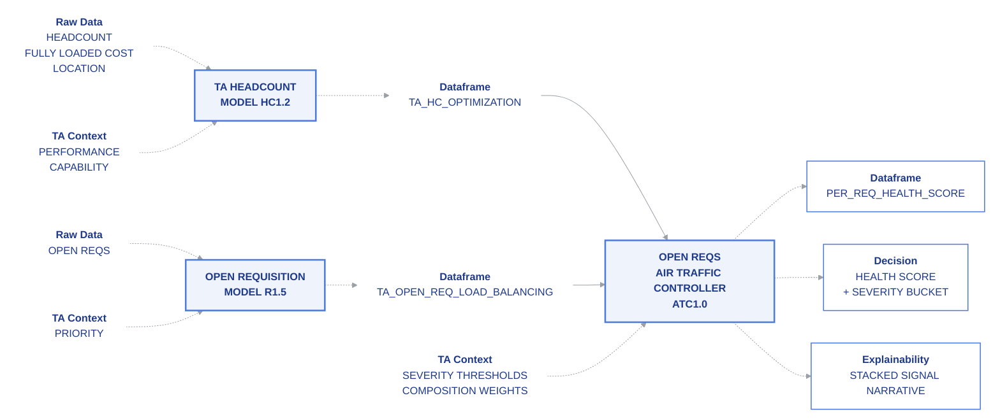

BlueCube is the methodology framework for Talent Acquisition decision intelligence, built on composable analytical primitives that produce explainable Health Scores on every requisition.

## Step 1: One BlueCube

A BlueCube is the analytical primitive of the methodology. One cube. One job. Inspectable from end to end.

Every Cube takes two inputs, runs a model, and produces three outputs. \
That's the whole shape.

### The Two Inputs

<Steps>
  <Step title="Input">
    The raw material the cube operates on. A dataset. A set of records. Whatever the cube is analyzing.
  </Step>
  <Step title="TA Context">
    What makes the BlueCube the BlueCube. Domain knowledge in structured form — peer group definitions, severity thresholds, role classifications, whatever the analytical work requires. TA Context is configuration. It can be a spreadsheet, a YAML file, or the output of another cube.
  </Step>
</Steps>

Without TA Context, the cube is a generic analytical method running against generic data. With TA Context, the cube becomes the TA-specific analytical work the methodology is authoring.

### The Model

The Model is what the cube does. Linear regression. KNN classification. KMeans clustering. DEA frontier analysis. Z-score peer benchmarking. Whatever method the cube's analytical work calls for.

The Model is open. A cube can use any method that produces defensible output against the inputs. The methodology doesn't prescribe a single method per cube — it specifies what comes in, what comes out, and that the work in between is documented.

### The Three Outputs

Every BlueCube produces the same three outputs, every time:

<Steps>
  <Step title="Data" stepNumber={4}>
    The dataframe. Per-row outputs from the model. Cluster labels, predictions, distances, classifications. The structured analytical result.
  </Step>
  <Step title="Decision" stepNumber={5}>
    The operational signal derived from the data. The Health Score contribution. The flag. The recommendation. The thing a TA operator can act on.
  </Step>
  <Step title="Explainability" stepNumber={6}>
    Plain English narrative explaining what the cube produced and why. Multi-run consensus counts. Confidence rates. The reason this requisition scored what it scored.
  </Step>
</Steps>

The three outputs are the cube's contract. Anything consuming a BlueCube knows it will receive a dataframe, a decision, and an explainability output. Always. Same shape across every cube.

### Why the Cube Matters

A black box produces an output and asks the consumer to trust it. The methodology underneath isn't visible. The reasoning isn't legible. The user has to decide whether to trust an opaque system.

A BlueCube produces an output and shows its work. The data is inspectable. The decision is documented. The explainability surfaces the methodology underneath. The user trusts the output because the output earns trust by exposing how it was produced.

That's the whole commitment. Every cube. Every output. Every time.

**It's a BlueCube, not a Black Box.**

## Step 2: Two Cubes

## Step 3: Putting It All Together

### Air Traffic Controller for Opening Requisitions

Two cubes upstream. One cube downstream. The Air Traffic Controller composes the methodology into a Health Score on every open requisition.

The Headcount cube produces workforce composition signal. The Requisition Load Balancing cube produces recruiter-to-req ratio signal. The Open Reqs Air Traffic Controller cube consumes both, applies its own TA Context, and produces the Health Score that lands on the requisition record.

That's the full wiring:

### What the Air Traffic Controller Does

The ATC cube doesn't run a model in the predictive sense. It composes upstream signals with documented weights against the open requisition's attributes.

For each open requisition, the ATC cube:

- Reads the workforce optimization signal from the Headcount cube's dataframe output
- Reads the recruiter capacity signal from the Load Balancing cube's dataframe output
- Applies severity thresholds and composition weights from its TA Context
- Produces a Health Score per requisition with severity bucket classification
- Generates plain English explainability that surfaces which upstream signals contributed

The Health Score is the methodology's final operational artifact. It lands as a custom field on the requisition record in any ATS that supports custom fields and CSV import.

### The Three-Output Contract at the Composition Layer

The ATC cube produces the same three outputs as every other BlueCube, just composed from upstream signals:

**Dataframe.** Per-requisition Health Score with full signal decomposition columns — workforce signal contribution, capacity signal contribution, composition weights applied, final score.

**Decision.** The Health Score number plus the severity bucket (normal / watch / monitor / inspect) that operators filter and sort by.

**Explainability.** Plain English narrative explaining the score. _Workforce composition shows favorable signal at 0.8 strength. Recruiter capacity below frontier at 0.4 strength. Combined weighted score: 34. Severity: monitor._

### Why Composition Through Cubes

A monolithic predictive model would produce the same Health Score number without showing its work. The composition through three cubes — Headcount, Load Balancing, ATC — produces the score with full traceability. Every component is inspectable. Every weight is documented. Every signal traces to a specific upstream cube's analytical work.

That's the methodology realized at the composition layer. The Health Score isn't an opinion. It's a documented composition of measurable signals, each defensible on its own, stacked into a single operationally legible field.

**It's a BlueCube, not a Black Box. Composed.**